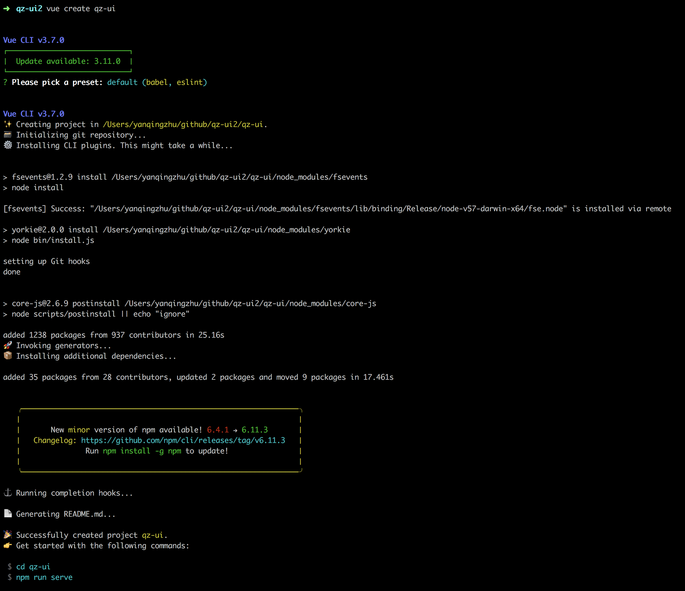

#### 参考

https://vv-ui.github.io/VV-UI/#/giud 

https://zhuanlan.zhihu.com/p/30948290

https://www.jianshu.com/p/91a10f581e9a

### 从零开始搭建Vue的UI组件库

随着react\vue\angular的发展，前端组件化也成为一个热门话题。针对vue框架，目前有UI框架有Element、iview、vuetify等。由于各个公司业务的不同，都想开发一套属于自己的组件库，实现定制化、可维护化。对于我们公司来说，目前有hui-vue。尽管公司有自己的组件库，了解组件库是怎么开发还是非常有必要的，一方面，能够更好地使用组件库，另一方面，可以贡献自己的代码。这里记录一下我从零开始搭建起来的组件库的过程。

#### 环境搭建（截图）

- 先下载项目

- 修改文件夹的名字

- 装markdown文档  使用test测试（添加路由）

#### 组件开发

- tag组件开发（插件开发）

- 字体介绍

- postcss介绍（换肤）

#### 发布组件库

- npm publish

#### 不足之处

- 按需加载等

#### 项目地址和演示地址

- github地址

#### 参考文档